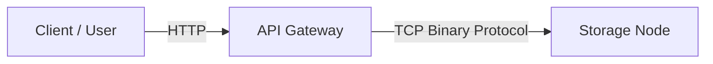

# API Gateway (KoopDB)

The **API Gateway** is the high-performance entry point for the KoopDB distributed storage system. It provides a standard RESTful interface (HTTP) for clients to store, retrieve, and delete objects, while handling the translation to the system's custom binary storage protocol on the backend.

Built with **Java 21**, **Javalin**, and **Virtual Threads**, it is designed for high concurrency and low-latency streaming.

## 🚀 Features

* **RESTful Interface:** Simple PUT, GET, and DELETE endpoints.
* **Zero-Copy Streaming:** Streams data directly from the client to the storage node without buffering the entire file in memory (where possible).
* **Custom Binary Protocol:** Implements the v1 storage protocol (8-byte framing, Opcode-based) to communicate with Storage Nodes.
* **Virtual Threads:** Uses Java 21's `Thread.ofVirtual()` for handling thousands of concurrent requests efficiently.
* **Docker Ready:** Includes a multi-stage Dockerfile for small, production-ready images.

## 🛠️ Architecture

The Gateway acts as a **Smart Client** for the storage layer. It performs the following roles:
1.  **Router:** Calculates the partition for a given key (`hash(key) % 10`).
2.  **Protocol Translator:** Converts HTTP requests into binary TCP packets.
3.  **Load Balancer:** (Future) Will distribute requests across available storage nodes.



## ⚙️ Configuration

The application is configured via environment variables.

| Variable | Description | Default |
| --- | --- | --- |
| `STORAGE_HOST` | Hostname/IP of the Storage Node | `localhost` |
| `STORAGE_PORT` | Port of the Storage Node | `8080` |
| `PORT` | HTTP Port for the Gateway to listen on | `8080` |

## 📦 Prerequisites

* **Java:** JDK 21+
* **Maven:** 3.9+
* **Docker:** (Optional)

## 🏃‍♂️ Running Locally

1. **Build the Project:**
```bash
mvn clean package

```


2. **Run the JAR:**
```bash
# Example connecting to a storage node on port 9092
export STORAGE_HOST=localhost
export STORAGE_PORT=9092

java -jar target/api-gateway-1.0.0.jar

```


## 🐳 Running with Docker

1. **Build the Image:**
```bash
docker build -t koop-gateway .

```


2. **Run the Container:**
```bash
docker run -p 8080:8080 \
  -e STORAGE_HOST=host.docker.internal \
  -e STORAGE_PORT=9092 \
  koop-gateway

```


## 🔌 API Usage

### 1. Store an Object (PUT)

Uploads a file to a specific bucket and key.

```bash
curl -X PUT -T ./my-video.mp4 http://localhost:8080/videos/movie.mp4

```

### 2. Retrieve an Object (GET)

Downloads a file.

```bash
curl -O http://localhost:8080/videos/movie.mp4

```

### 3. Delete an Object (DELETE)

Removes the file from storage.

```bash
curl -X DELETE http://localhost:8080/videos/movie.mp4

```

### 4. Health Check

Verifies the gateway is running.

```bash
curl http://localhost:8080/health
# Output: API Gateway is healthy!

```

## 📄 Storage Protocol (Internal)

The Gateway communicates with backend nodes using a custom binary frame format over TCP:

| Component | Size | Description |
| --- | --- | --- |
| **Frame Length** | 8 bytes | Total length of payload + opcode |
| **Opcode** | 4 bytes | `1` (PUT), `2` (DELETE), `6` (GET) |
| **Payload** | Variable | Specific data for the operation |

* **Strings:** Encoded as `[4-byte Length][UTF-8 Bytes]`.
* **Requests:** All PUT requests generate a unique UUID for versioning.