# Workflow Diagrams

This document displays workflow diagrams for each supported use case in the Koop distributed object store. Koop exposes an S3-compatible API; all operations flow through the **Query Processor (QP)** gateway before being fanned out to **Storage Nodes (SN)** via erasure-coded shards.

> **Related documents:**
> - [Scope](scope.md) — supported use cases and error cases
> - [Architecture](architecture.md) — system component overview and redundancy model

---

## Table of Contents

1. [System Component Overview](#system-component-overview)
2. [PUT Object](#1-put-object)
3. [GET Object](#2-get-object)
4. [DELETE Object](#3-delete-object)
5. [Create Bucket](#4-create-bucket)
6. [Delete Bucket](#5-delete-bucket)
7. [Head Bucket (Bucket Exists)](#6-head-bucket-bucket-exists)
8. [List Objects in Bucket](#7-list-objects-in-bucket)
9. [Multipart Upload — Create](#8-multipart-upload--create)
10. [Multipart Upload — Upload Part](#9-multipart-upload--upload-part)
11. [Multipart Upload — Complete](#10-multipart-upload--complete)
12. [Multipart Upload — Abort](#11-multipart-upload--abort)
13. [Storage Node Repair Flow](#12-storage-node-repair-flow)
14. [Gossip-Based Garbage Collection](#13-gossip-based-garbage-collection)

---

## System Component Overview

The following diagram shows the high-level components involved in every workflow. Each request enters through the S3-compatible HTTP gateway ([`Main.java`](../query-processor/src/main/java/com/github/koop/queryprocessor/gateway/Main.java)), is processed by the [`StorageWorker`](../query-processor/src/main/java/com/github/koop/queryprocessor/processor/StorageWorker.java), and is fanned out to 9 storage nodes per erasure set. Kafka (pub/sub) is used for multipart commit sequencing and is the planned sequencer for write/delete ordering. Redis (or an in-memory [`MemoryCacheClient`](../query-processor/src/main/java/com/github/koop/queryprocessor/processor/cache/MemoryCacheClient.java) in dev/test) is used by the Query Processor for multipart upload session tracking. Each storage node persists shard data to disk via [`StorageNodeServer`](../storage-node/src/main/java/com/github/koop/storagenode/StorageNodeServer.java) backed by [`StorageNode`](../storage-node/src/main/java/com/github/koop/storagenode/StorageNode.java). The [`StorageNodeV2`](../storage-node/src/main/java/com/github/koop/storagenode/StorageNodeV2.java) + [`Database`](../storage-node/src/main/java/com/github/koop/storagenode/db/Database.java) (RocksDB) layer is implemented and tested but not yet wired into the live server.

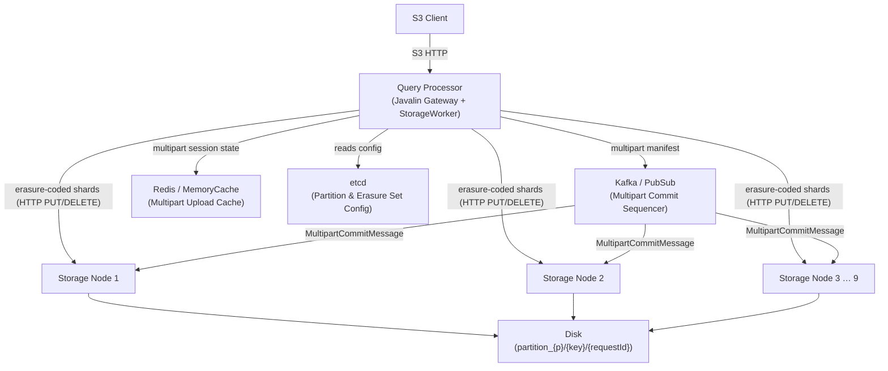

---

## 1. PUT Object

**Route:** `PUT /{bucket}/{key}`

The QP erasure-encodes the object into 9 shards and streams them concurrently to all storage nodes via HTTP. Each storage node writes the shard to disk under `partition_{partition}/{key}/{requestId}` and atomically updates the `current` version pointer. A write quorum of ≥ 6 out of 9 nodes must acknowledge before the client receives a response.

> **Implementation note:** Kafka-based sequencing for PUT is designed and planned (see `messy-everything-doc.md`). In the current codebase, [`StorageWorker.put()`](../query-processor/src/main/java/com/github/koop/queryprocessor/processor/StorageWorker.java:106) streams shards directly to storage nodes and returns after quorum ACKs. The [`StorageNodeServer`](../storage-node/src/main/java/com/github/koop/storagenode/StorageNodeServer.java) uses [`StorageNode.store()`](../storage-node/src/main/java/com/github/koop/storagenode/StorageNode.java:122) (disk-only, no RocksDB).

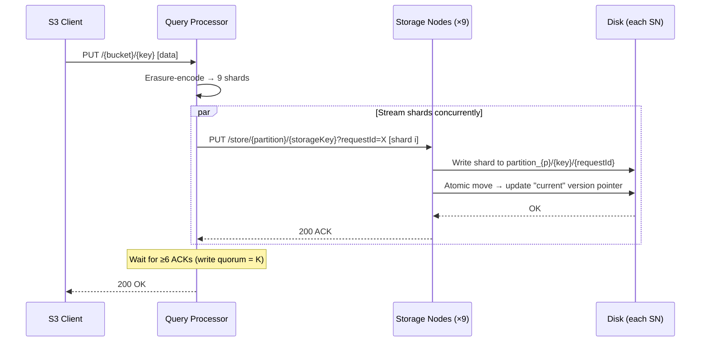

### Error Cases

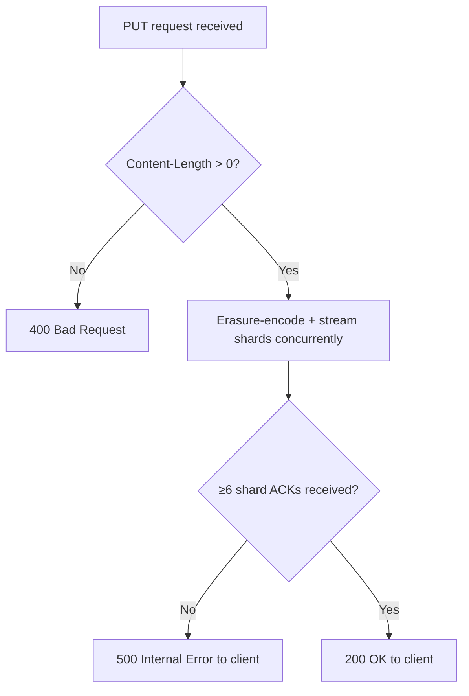

---

## 2. GET Object

**Route:** `GET /{bucket}/{key}`

The QP queries all 9 storage nodes for their shard. At least 6 shards (the erasure coding threshold `K`) must be available to reconstruct the object. The QP streams the reconstructed data back to the client.

See [`StorageWorker.get()`](../query-processor/src/main/java/com/github/koop/queryprocessor/processor/StorageWorker.java:180) and [`StorageNode.retrieve()`](../storage-node/src/main/java/com/github/koop/storagenode/StorageNode.java:171).

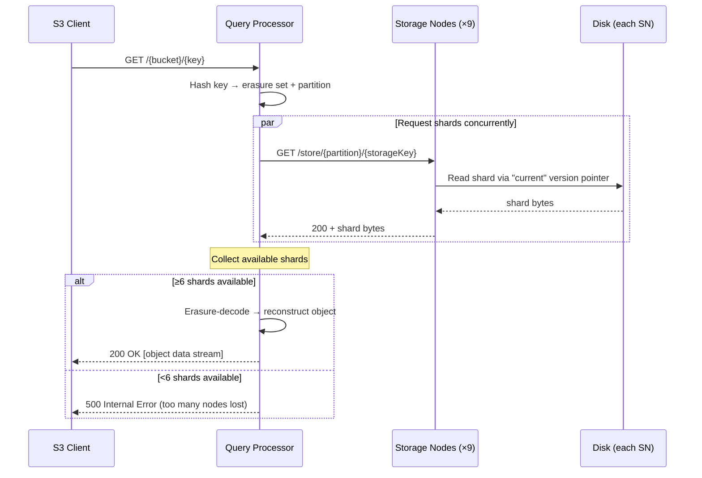

### Conflicting Versions

When nodes return different versions of the same key (e.g., a write is mid-commit), the QP returns the version that at least a read quorum (6/9) of nodes agree on. If no version reaches quorum, the operation fails immediately — the system does **not** wait for stabilization.

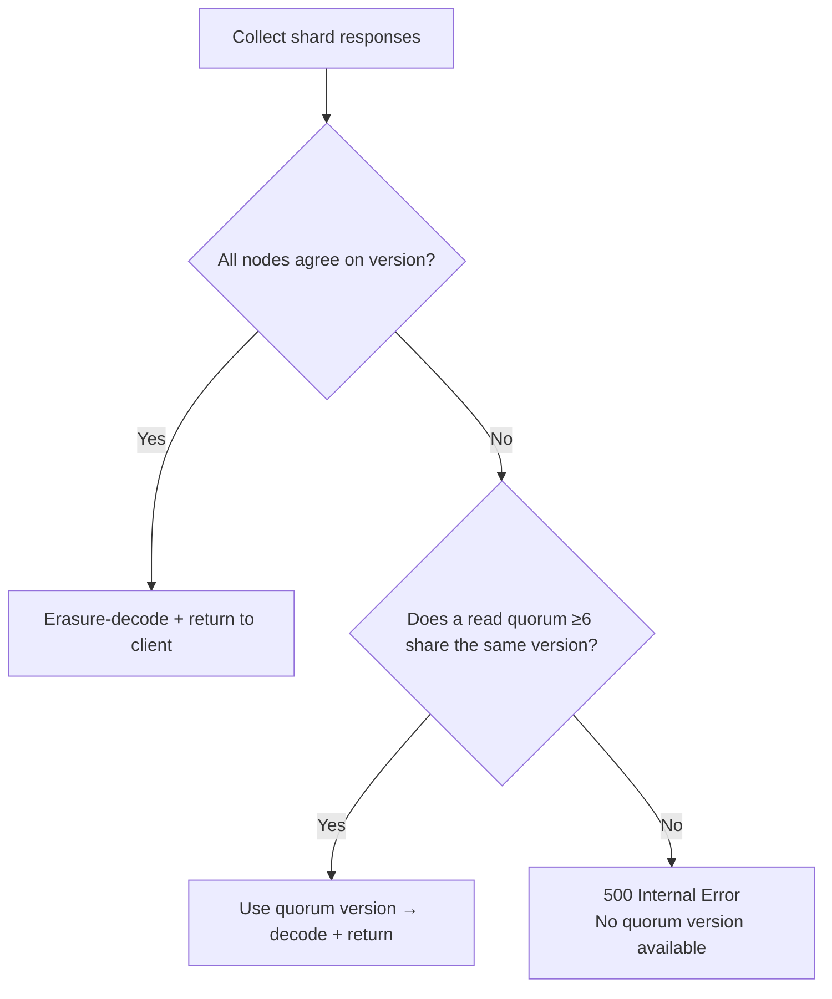

---

## 3. DELETE Object

**Route:** `DELETE /{bucket}/{key}`

The QP sends DELETE requests concurrently to all 9 storage nodes via HTTP. Each storage node performs a logical delete by atomically removing the `current` version pointer file; physical shard data is cleaned up asynchronously by a background virtual thread.

> **Implementation note:** Kafka-based sequencing for DELETE is designed and planned. In the current codebase, [`StorageWorker.delete()`](../query-processor/src/main/java/com/github/koop/queryprocessor/processor/StorageWorker.java:212) sends HTTP DELETE directly to all nodes and requires **all** nodes to ACK (not just a quorum). [`StorageNode.delete()`](../storage-node/src/main/java/com/github/koop/storagenode/StorageNode.java:187) performs a logical delete (removes the version tracking file); physical file removal is async.

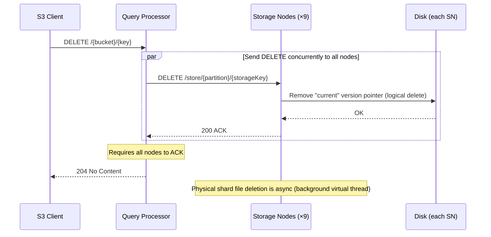

---

## 4. Create Bucket

**Route:** `PUT /{bucket}`

> **Not yet implemented.** [`StorageWorkerService.createBucket()`](../query-processor/src/main/java/com/github/koop/queryprocessor/gateway/StorageServices/StorageWorkerService.java:94) currently throws `UnsupportedOperationException`, returning `501 Not Implemented` to the client.

The planned flow: bucket creation is sequenced through Kafka/pub/sub. Storage nodes store the bucket record in their RocksDB bucket table (via [`Database.createBucket()`](../storage-node/src/main/java/com/github/koop/storagenode/db/Database.java:81) and [`StorageNodeV2.createBucket()`](../storage-node/src/main/java/com/github/koop/storagenode/StorageNodeV2.java:248)). A write quorum must acknowledge before the client is notified.

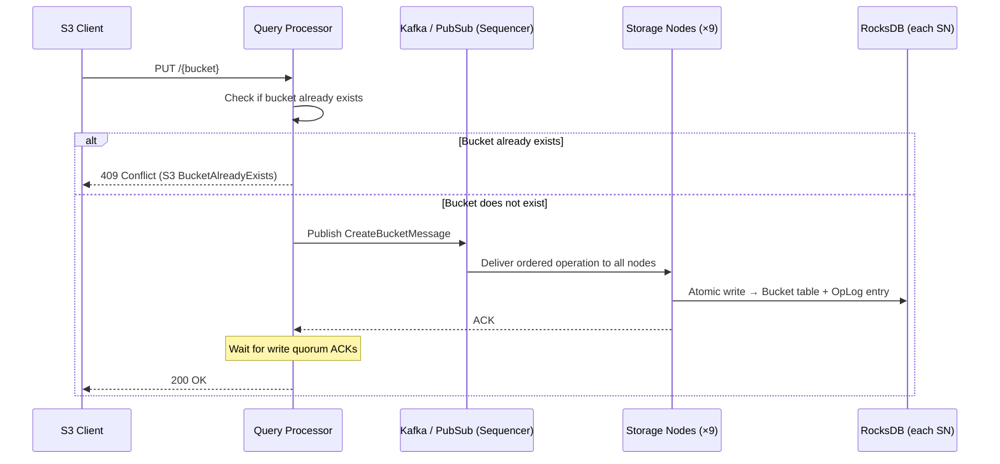

---

## 5. Delete Bucket

**Route:** `DELETE /{bucket}`

> **Not yet implemented.** [`StorageWorkerService.deleteBucket()`](../query-processor/src/main/java/com/github/koop/queryprocessor/gateway/StorageServices/StorageWorkerService.java:100) currently throws `UnsupportedOperationException`, returning `501 Not Implemented` to the client.

The planned flow: bucket deletion publishes a `DeleteBucketMessage` via pub/sub. Storage nodes write a tombstone to the RocksDB bucket table (via [`Database.deleteBucket()`](../storage-node/src/main/java/com/github/koop/storagenode/db/Database.java:91)). The bucket record is logically deleted; any remaining objects in the bucket are not immediately purged.

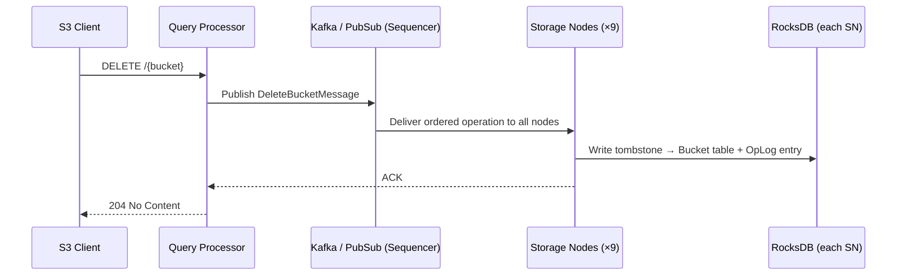

---

## 6. Head Bucket (Bucket Exists)

**Route:** `HEAD /{bucket}`

> **Not yet implemented.** [`StorageWorkerService.bucketExists()`](../query-processor/src/main/java/com/github/koop/queryprocessor/gateway/StorageServices/StorageWorkerService.java:112) currently throws `UnsupportedOperationException`, returning `501 Not Implemented` to the client.

The planned flow: a lightweight existence check. The QP queries the bucket table on storage nodes and returns 200 if the bucket exists, 404 if not.

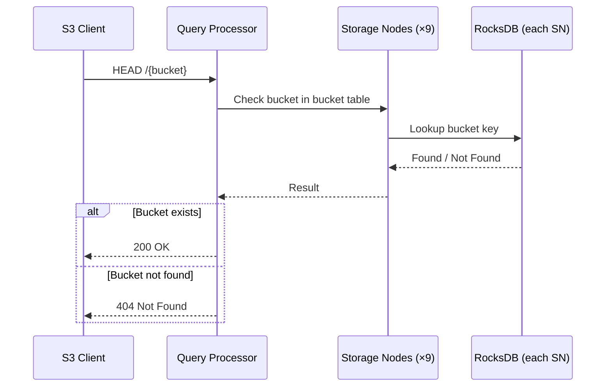

---

## 7. List Objects in Bucket

**Route:** `GET /{bucket}?prefix=...&max-keys=...`

> **Not yet implemented.** [`StorageWorkerService.listObjects()`](../query-processor/src/main/java/com/github/koop/queryprocessor/gateway/StorageServices/StorageWorkerService.java:106) currently throws `UnsupportedOperationException`, returning `501 Not Implemented` to the client.

The planned flow: the QP streams metadata from all storage nodes using a prefix range scan on the RocksDB metadata table. Because objects in the same bucket may be spread across different erasure sets (based on key hashing), all nodes must be queried. Conflicting versions are resolved using the same read-quorum semantics as GET Object.

See [`Database.listItemsInBucket()`](../storage-node/src/main/java/com/github/koop/storagenode/db/Database.java:111) and [`StorageNodeV2.listItemsInBucket()`](../storage-node/src/main/java/com/github/koop/storagenode/StorageNodeV2.java:295).

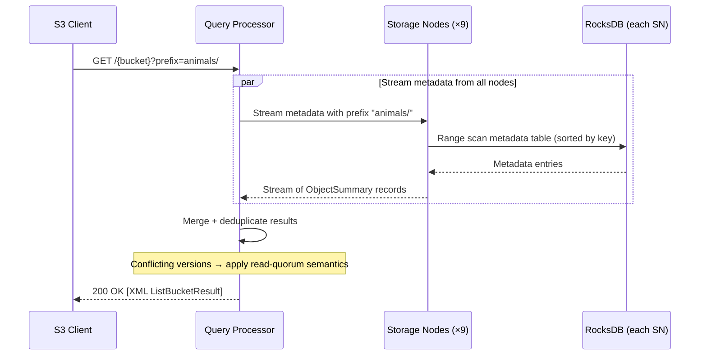

---

## 8. Multipart Upload — Create

**Route:** `POST /{bucket}/{key}?uploads`

Initiates a multipart upload session. The QP generates a unique `uploadId` and stores the session state in the cache (Redis in production, in-memory for dev/test). No data is written to storage nodes at this stage.

See [`MultipartUploadManager.initiateMultipartUpload()`](../query-processor/src/main/java/com/github/koop/queryprocessor/processor/MultipartUploadManager.java:35).

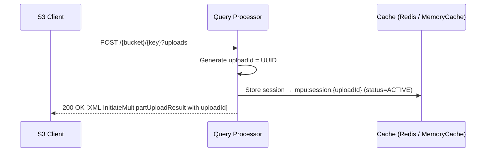

---

## 9. Multipart Upload — Upload Part

**Route:** `PUT /{bucket}/{key}?partNumber=N&uploadId=X`

Each part is stored as an independent erasure-coded object on the storage nodes using a derived key. The cache is updated only **after** the storage nodes confirm the shard write, ensuring the client is not ACKed until the part is durably stored. The part's byte size is also cached for use during completion.

See [`MultipartUploadManager.uploadPart()`](../query-processor/src/main/java/com/github/koop/queryprocessor/processor/MultipartUploadManager.java:50).

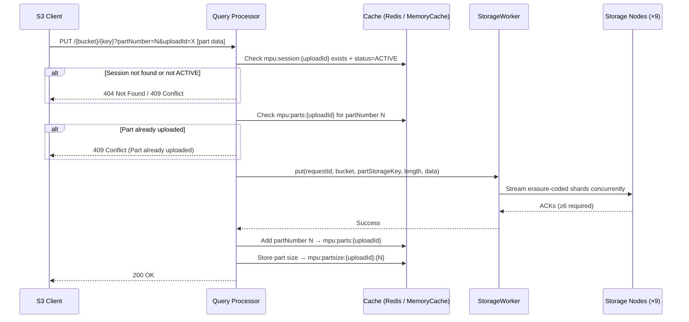

---

## 10. Multipart Upload — Complete

**Route:** `POST /{bucket}/{key}?uploadId=X`

The QP verifies all declared parts are present in the cache and that cached sizes are valid, then transitions the session to `COMPLETING` and publishes a [`MultipartCommitMessage`](../common-lib/src/main/java/com/github/koop/common/messages/Message.java:97) via pub/sub to the partition-keyed topic. The message carries the ordered list of part numbers. **Parts are not concatenated or re-uploaded** — they remain as individual erasure-coded shards in storage; reconstruction happens on read. The cache session and part metadata are cleaned up after successful publish.

See [`MultipartUploadManager.completeMultipartUpload()`](../query-processor/src/main/java/com/github/koop/queryprocessor/processor/MultipartUploadManager.java:104).

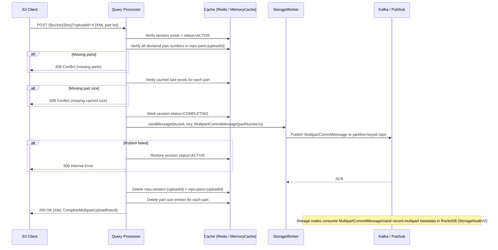

---

## 11. Multipart Upload — Abort

**Route:** `DELETE /{bucket}/{key}?uploadId=X`

The session is marked as `ABORTING`. Part shards are then deleted from storage nodes synchronously (best-effort per part), and the cache session is cleaned up. The client receives `204 No Content` after all cleanup completes.

> **Pending team decision:** Whether part deletion should remain synchronous (current behavior — client waits for all shard deletes) or be deferred/async (ACK immediately, clean up in background). See [`MultipartUploadManager.abortMultipartUpload()`](../query-processor/src/main/java/com/github/koop/queryprocessor/processor/MultipartUploadManager.java:197) and the TODO comment therein.

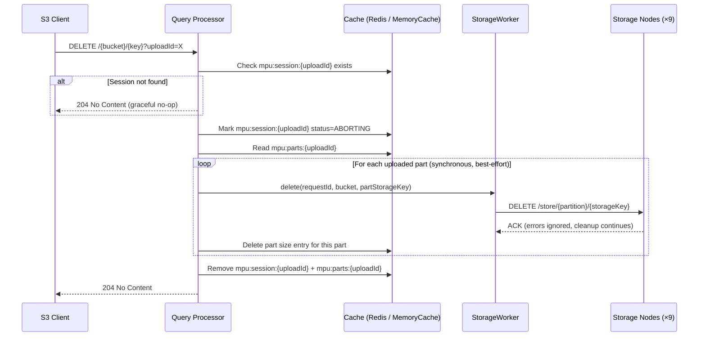

---

## 12. Storage Node Repair Flow

> **Not yet implemented.** This flow relies on the RocksDB-based `StorageNodeV2` which is not yet wired into the live server. The current `StorageNode` implementation does not support repair.

When a storage node comes back online after missing operations, it detects the gap by comparing the sequence number it last processed against the sequence number of the next incoming operation. It enters repair mode, broadcasts to peer nodes for the missed operations, and replays them — skipping any keys that have already been updated since the node came back online.

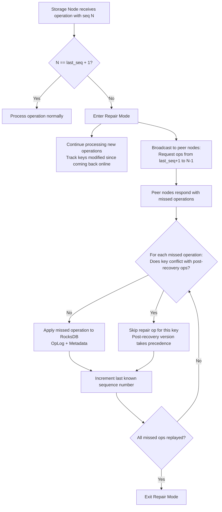

---

## 13. Gossip-Based Garbage Collection

> **Not yet implemented.** This flow relies on the RocksDB-based `StorageNodeV2` which is not yet wired into the live server. The current `StorageNode` implementation uses a simple background thread to delete replaced versions immediately (best-effort).

Storage nodes periodically gossip their current sequence number (and the lowest sequence number of any active GET in flight). Any shard data associated with a sequence number below the global minimum is safe to physically delete from disk.

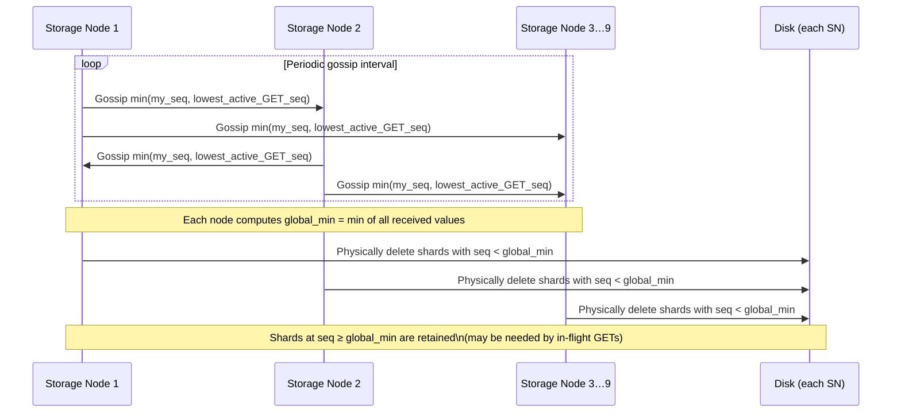

---

## RocksDB Table Reference

The [`Database`](../storage-node/src/main/java/com/github/koop/storagenode/db/Database.java) facade and [`StorageNodeV2`](../storage-node/src/main/java/com/github/koop/storagenode/StorageNodeV2.java) define three RocksDB tables written atomically on every PUT/DELETE/bucket operation. This layer is fully implemented and tested but is not yet wired into the live [`StorageNodeServer`](../storage-node/src/main/java/com/github/koop/storagenode/StorageNodeServer.java) (which currently uses [`StorageNode`](../storage-node/src/main/java/com/github/koop/storagenode/StorageNode.java), disk-only).

| Table | Key | Value | Purpose |
|---|---|---|---|
| **OpLog** | Sequence Number | `(key, operation)` | Ordered log of all mutations; enables repair |
| **Metadata** | Object Key | `(partition, seq, location)` | Latest shard location per object key; supports regular, multipart, and tombstone versions |
| **Buckets** | Bucket Name | `(partition, seq, deleted)` | Bucket existence and tombstone tracking |

See [`Database.putItem()`](../storage-node/src/main/java/com/github/koop/storagenode/db/Database.java:24), [`Database.deleteItem()`](../storage-node/src/main/java/com/github/koop/storagenode/db/Database.java:45), and [`Database.createBucket()`](../storage-node/src/main/java/com/github/koop/storagenode/db/Database.java:81) for the atomic write implementations.
