# Workflow Diagrams

This document displays workflow diagrams for each supported use case in the Koop distributed object store. Koop exposes an S3-compatible API; all operations flow through the **Query Processor (QP)** gateway before being fanned out to **Storage Nodes (SN)** via erasure-coded shards.

> **Related documents:**
> - [Scope](scope.md) — supported use cases and error cases
> - [Architecture](architecture.md) — system component overview and redundancy model

---

## Table of Contents

1. [System Component Overview](#system-component-overview)
2. [PUT Object](#1-put-object)
3. [GET Object](#2-get-object)
4. [DELETE Object](#3-delete-object)
5. [Create Bucket](#4-create-bucket)
6. [Delete Bucket](#5-delete-bucket)
7. [Head Bucket (Bucket Exists)](#6-head-bucket-bucket-exists)
8. [List Objects in Bucket](#7-list-objects-in-bucket)
9. [Multipart Upload — Create](#8-multipart-upload--create)
10. [Multipart Upload — Upload Part](#9-multipart-upload--upload-part)
11. [Multipart Upload — Complete](#10-multipart-upload--complete)
12. [Multipart Upload — Abort](#11-multipart-upload--abort)
13. [Storage Node Repair Flow](#12-storage-node-repair-flow)
14. [Gossip-Based Garbage Collection](#13-gossip-based-garbage-collection)

---

## System Component Overview

The following diagram shows the high-level components involved in every workflow. Each request enters through the S3-compatible HTTP gateway ([`Main.java`](../query-processor/src/main/java/com/github/koop/queryprocessor/gateway/Main.java)), is processed by the [`StorageWorker`](../query-processor/src/main/java/com/github/koop/queryprocessor/processor/StorageWorker.java), and is fanned out to 9 storage nodes per erasure set. Kafka acts as the global sequencer for write/delete ordering, delivering an ordered operation log to every storage node. Redis is used separately by the Query Processor for multipart upload session tracking. Each storage node persists shard data to disk and records metadata + operation logs atomically in RocksDB via the [`Database`](../storage-node/src/main/java/com/github/koop/storagenode/db/Database.java) layer.

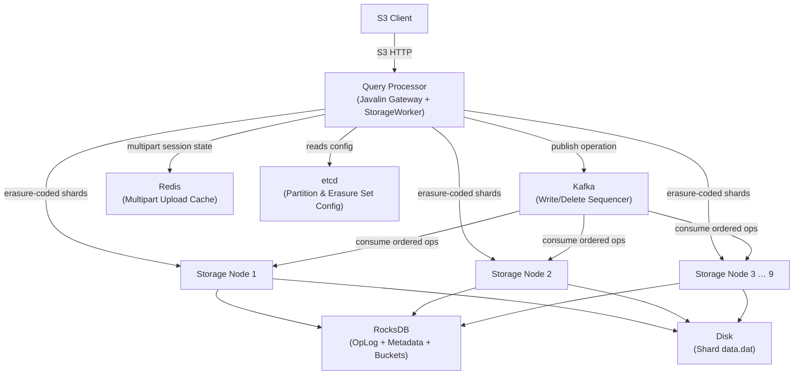

---

## 1. PUT Object

**Route:** `PUT /{bucket}/{key}`

The QP erasure-encodes the object into 9 shards and streams them concurrently to all storage nodes. The QP then publishes the PUT operation to Kafka, which assigns a sequence number and delivers it to every storage node in order. Each node atomically commits the operation log and metadata in RocksDB. A write quorum of ≥ 6 out of 9 nodes must acknowledge before the client receives a response.

See [`StorageWorker.put()`](../query-processor/src/main/java/com/github/koop/queryprocessor/processor/StorageWorker.java:65) and [`StorageNode.store()`](../storage-node/src/main/java/com/github/koop/storagenode/StorageNode.java:122).

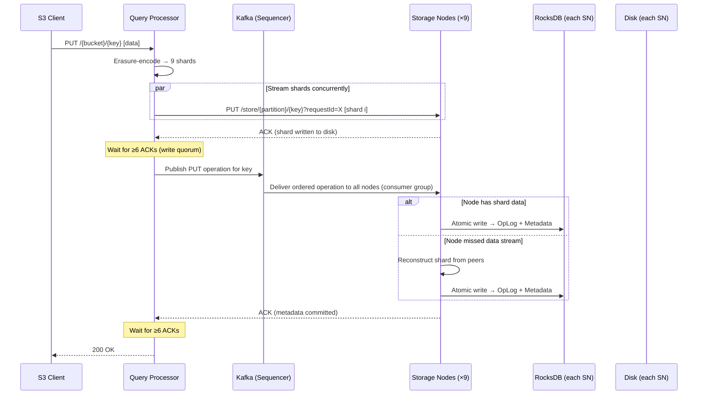

### Error Cases

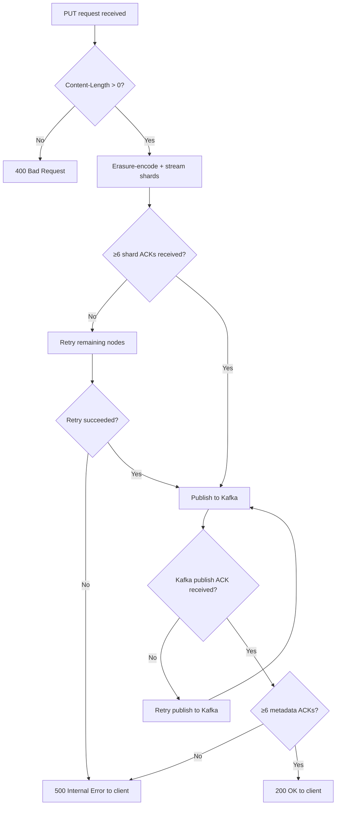

---

## 2. GET Object

**Route:** `GET /{bucket}/{key}`

The QP queries all 9 storage nodes for their shard. At least 6 shards (the erasure coding threshold `K`) must be available to reconstruct the object. The QP streams the reconstructed data back to the client.

See [`StorageWorker.get()`](../query-processor/src/main/java/com/github/koop/queryprocessor/processor/StorageWorker.java:143) and [`StorageNode.retrieve()`](../storage-node/src/main/java/com/github/koop/storagenode/StorageNode.java:171).

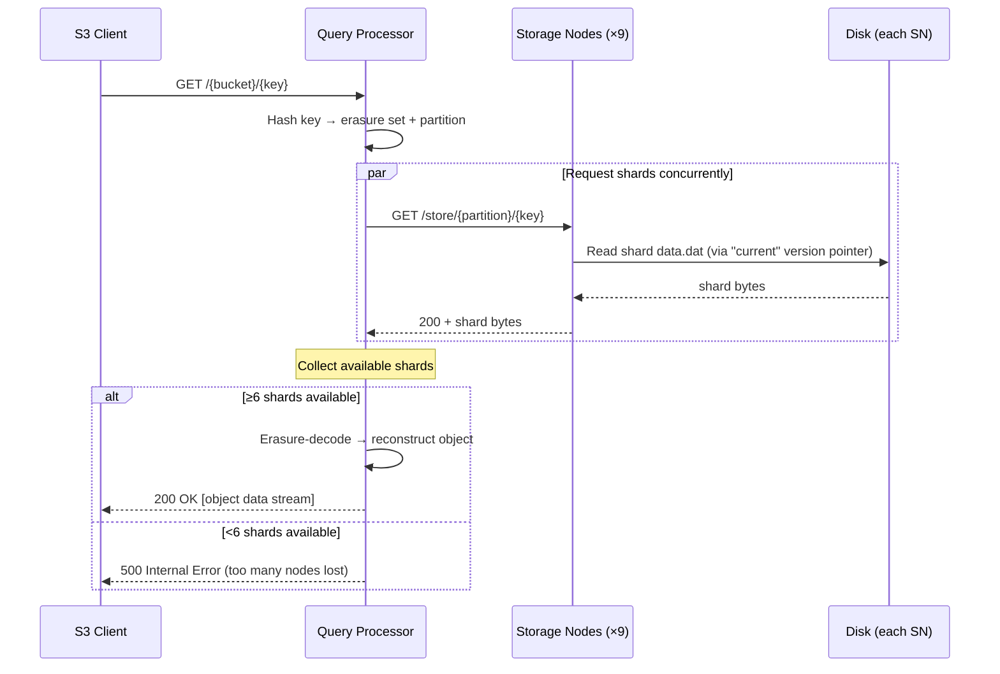

### Conflicting Versions

When nodes return different versions of the same key (e.g., a write is mid-commit), the QP returns the version that at least a read quorum (6/9) of nodes agree on. If no version reaches quorum, the operation fails immediately — the system does **not** wait for stabilization.

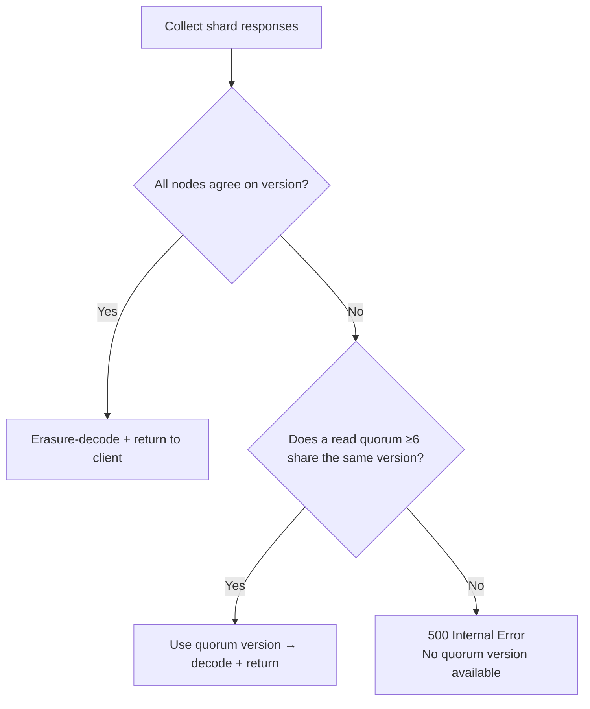

---

## 3. DELETE Object

**Route:** `DELETE /{bucket}/{key}`

DELETE is sequenced through Kafka before storage nodes apply a tombstone to their metadata and operation log. No shard data is immediately removed from disk; physical deletion is handled asynchronously.

See [`StorageWorker.delete()`](../query-processor/src/main/java/com/github/koop/queryprocessor/processor/StorageWorker.java:175) and [`StorageNode.delete()`](../storage-node/src/main/java/com/github/koop/storagenode/StorageNode.java:187).

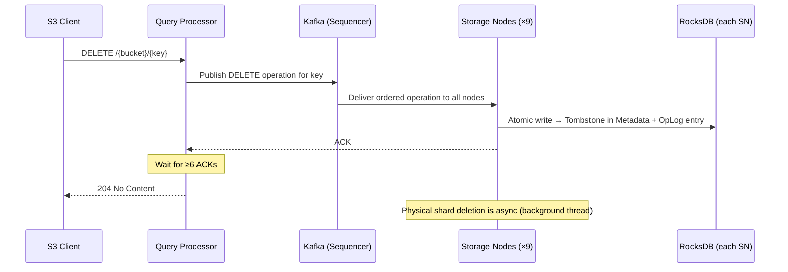

---

## 4. Create Bucket

**Route:** `PUT /{bucket}`

Bucket creation is sequenced through Kafka. Storage nodes store the bucket record in their RocksDB bucket table. A write quorum must acknowledge before the client is notified.

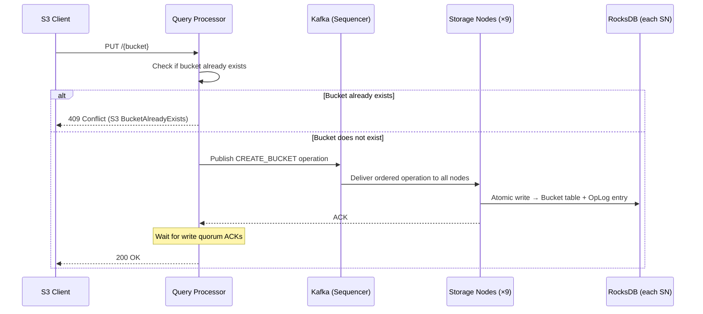

---

## 5. Delete Bucket

**Route:** `DELETE /{bucket}`

Bucket deletion writes a tombstone to the bucket table on each storage node. The bucket record is logically deleted; any remaining objects in the bucket are not immediately purged.

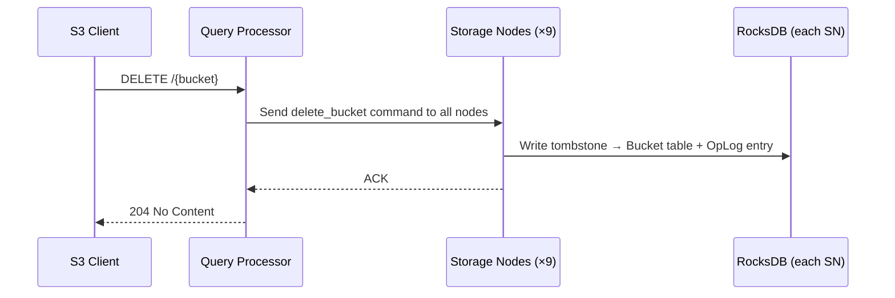

---

## 6. Head Bucket (Bucket Exists)

**Route:** `HEAD /{bucket}`

A lightweight existence check. The QP queries the bucket table on storage nodes and returns 200 if the bucket exists, 404 if not.

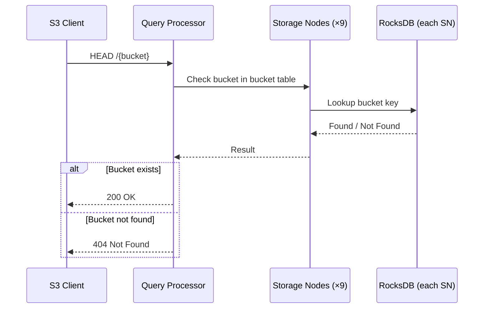

---

## 7. List Objects in Bucket

**Route:** `GET /{bucket}?prefix=...&max-keys=...`

The QP streams metadata from all storage nodes using a prefix range scan on the RocksDB metadata table. Because objects in the same bucket may be spread across different erasure sets (based on key hashing), all nodes must be queried. Conflicting versions are resolved using the same read-quorum semantics as GET Object.

See [`Database.streamMetadataWithPrefix()`](../storage-node/src/main/java/com/github/koop/storagenode/db/Database.java:41).

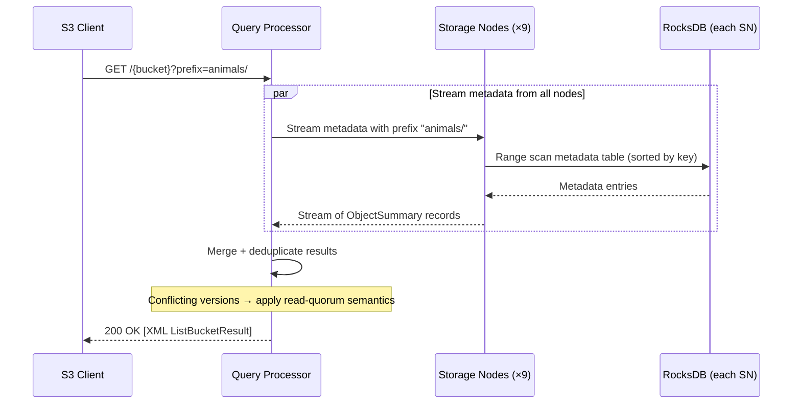

---

## 8. Multipart Upload — Create

**Route:** `POST /{bucket}/{key}?uploads`

Initiates a multipart upload session. The QP generates a unique `uploadId` and stores the session state in the cache (Redis in production, in-memory for dev/test). No data is written to storage nodes at this stage.

See [`MultipartStorageService.initiateMultipartUpload()`](../query-processor/src/main/java/com/github/koop/queryprocessor/gateway/StorageServices/MultipartStorageService.java) and the [multipart upload plan](../plans/multipart-upload-plan.md).

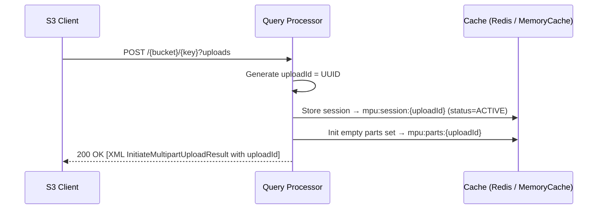

---

## 9. Multipart Upload — Upload Part

**Route:** `PUT /{bucket}/{key}?partNumber=N&uploadId=X`

Each part is stored as an independent erasure-coded object on the storage nodes using a derived key. The cache is updated only **after** the storage nodes confirm the shard write, ensuring the client is not ACKed until the part is durably stored.

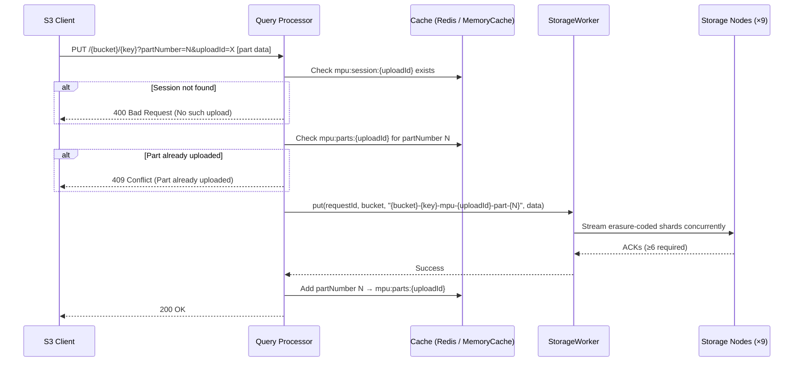

---

## 10. Multipart Upload — Complete

**Route:** `POST /{bucket}/{key}?uploadId=X`

The QP verifies all declared parts are present in the cache, then assembles the final object by concatenating part streams and issuing a single `put` to the storage nodes under the original key. Part shards are cleaned up asynchronously.

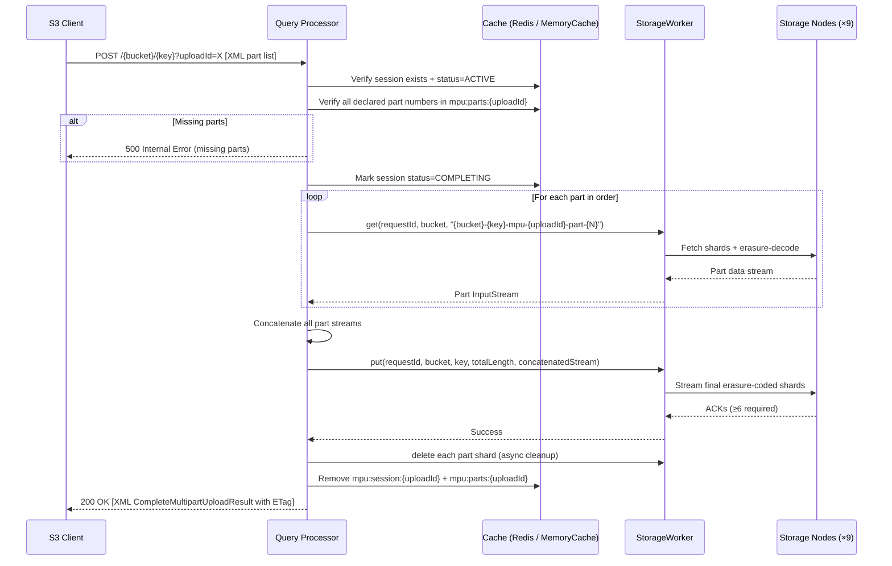

---

## 11. Multipart Upload — Abort

**Route:** `DELETE /{bucket}/{key}?uploadId=X`

The session is immediately marked as `ABORTING` and the client is ACKed. Part shard deletion from storage nodes is performed asynchronously to avoid blocking the client.

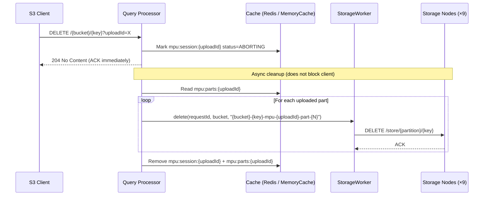

---

## 12. Storage Node Repair Flow

When a storage node comes back online after missing operations, it detects the gap by comparing the sequence number it last processed against the sequence number of the next incoming operation. It enters repair mode, broadcasts to peer nodes for the missed operations, and replays them — skipping any keys that have already been updated since the node came back online.

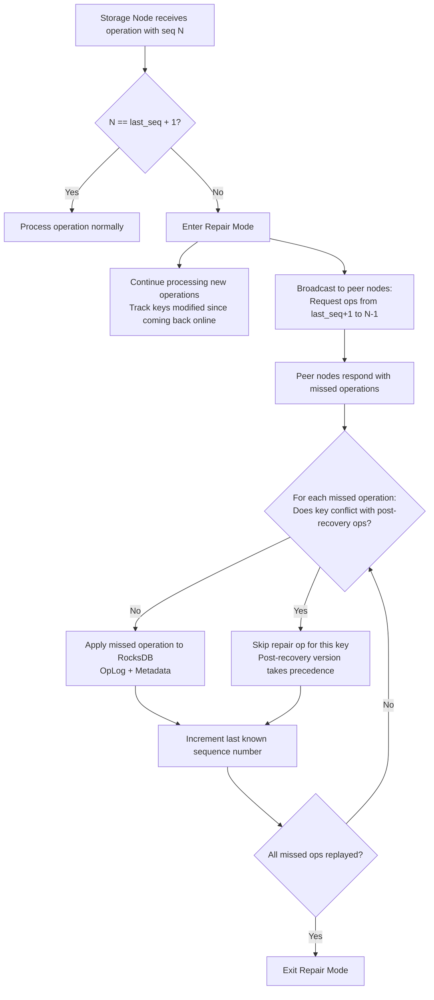

---

## 13. Gossip-Based Garbage Collection

Storage nodes periodically gossip their current sequence number (and the lowest sequence number of any active GET in flight). Any shard data associated with a sequence number below the global minimum is safe to physically delete from disk.

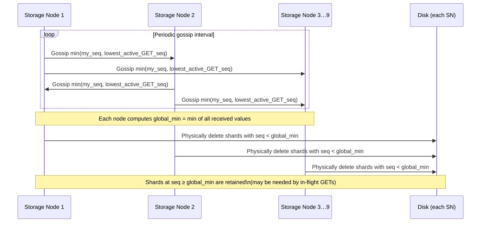

---

## RocksDB Table Reference

Each storage node maintains three tables in RocksDB, written atomically on every PUT/DELETE/bucket operation:

| Table | Key | Value | Purpose |
|---|---|---|---|
| **OpLog** | Sequence Number | `(key, operation)` | Ordered log of all mutations; enables repair |
| **Metadata** | Object Key | `(partition, seq, location)` | Latest shard location per object key |
| **Buckets** | Bucket Name | `(partition, seq)` | Bucket existence and tombstone tracking |

See [`Database.atomicallyUpdate()`](../storage-node/src/main/java/com/github/koop/storagenode/db/Database.java:23) for the atomic write implementation.
