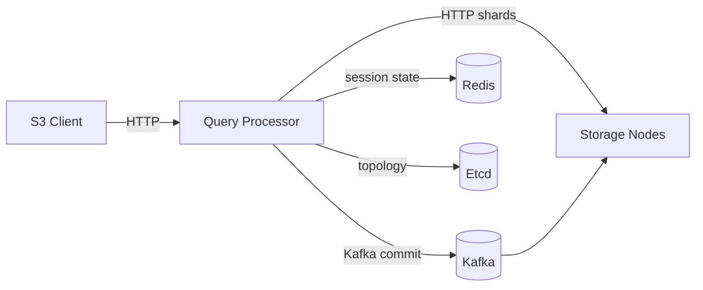

# API Gateway (KoopDB)

The **Query Processor** is the S3-compatible HTTP entry point for the KoopDB distributed storage system. It accepts S3 API requests from clients, erasure-codes object data, fans shards out to storage nodes over HTTP, and coordinates ordered commits through Kafka.

Built with **Java 21**, **Javalin**, and **Virtual Threads** for high concurrency and low-latency streaming.

## Features

- **S3-Compatible API:** PUT, GET, DELETE, HEAD, ListObjectsV2, and the full multipart upload flow (Initiate / UploadPart / Complete / Abort).
- **Erasure Coding:** Reed-Solomon encoding/decoding via the [`ErasureCoder`](../common-lib/src/main/java/com/github/koop/common/erasure/ErasureCoder.java); configuration is fetched from Etcd at startup.
- **Streaming HTTP to Storage Nodes:** Shards are streamed concurrently to storage nodes over HTTP using `java.net.http.HttpClient` (see [`StorageWorker`](src/main/java/com/github/koop/queryprocessor/processor/StorageWorker.java)).
- **Kafka-Sequenced Commits:** After shard write quorum, the [`CommitCoordinator`](src/main/java/com/github/koop/queryprocessor/processor/CommitCoordinator.java) publishes ordered commit messages on Kafka so storage nodes apply mutations in a consistent per-partition order.
- **Multipart Upload Sessions:** Session and part state tracked in Redis (or in-memory cache for dev/test) by the [`MultipartUploadManager`](src/main/java/com/github/koop/queryprocessor/processor/MultipartUploadManager.java).
- **Virtual Threads:** Javalin is configured with `useVirtualThreads = true` for handling thousands of concurrent requests.

## Architecture

The gateway acts as the smart client for the storage layer. Its responsibilities:

1. **Routing:** Maps a `(bucket, key)` to a partition, then to an erasure set, using configuration from Etcd ([`ErasureRouting`](../common-lib/src/main/java/com/github/koop/common/erasure/ErasureRouting.java) and [`PartitionSpreadConfiguration`](../common-lib/src/main/java/com/github/koop/common/metadata/PartitionSpreadConfiguration.java)).
2. **Erasure Encoding/Decoding:** Splits incoming objects into `k` data + `(n-k)` parity shards on PUT, reconstructs from any `k` available shards on GET.
3. **Quorum Coordination:** Waits for shard write ACKs from a configured `write_quorum` of nodes, then publishes a commit message via Kafka.
4. **Multipart Session State:** Tracks active multipart sessions and their parts in Redis.



## Configuration

The application is configured via environment variables.

| Variable | Description | Default |
| --- | --- | --- |
| `APP_PORT` | HTTP port for the gateway to listen on | `8080` |
| `ETCD_URL` | Etcd endpoint for cluster topology + erasure config | (required) |
| `KAFKA_BOOTSTRAP_SERVERS` | Kafka bootstrap servers for commit messages | (required) |
| `REDIS_URL` | Redis URL for multipart upload session state | (required) |
| `STORAGE_NODE_URL` | A storage node URL used during initial bootstrap | (required) |
| `NODE_IP` | This QP's identity for logging/metrics | (required) |

## Prerequisites

- **Java 21 JDK**
- **Maven 3.9+**
- **Docker** (optional)

## Running

The gateway is normally launched via the project-root `docker-compose.yml`, which wires up Etcd, Kafka, Redis, the storage nodes, and three query processor replicas on host ports `9001`, `9002`, `9003`.

```bash
# From the repository root
docker-compose up --build
```

## API Usage

```bash
# Health
curl http://localhost:9001/health

# PUT object
curl -X PUT -T ./video.mp4 http://localhost:9001/videos/movie.mp4

# GET object
curl -O http://localhost:9001/videos/movie.mp4

# DELETE object
curl -X DELETE http://localhost:9001/videos/movie.mp4

# List objects (ListObjectsV2)
curl "http://localhost:9001/videos?prefix=movie&max-keys=100"
```

For the complete API surface (multipart upload, bucket operations, error codes), see [`docs/api.md`](../docs/api.md).
